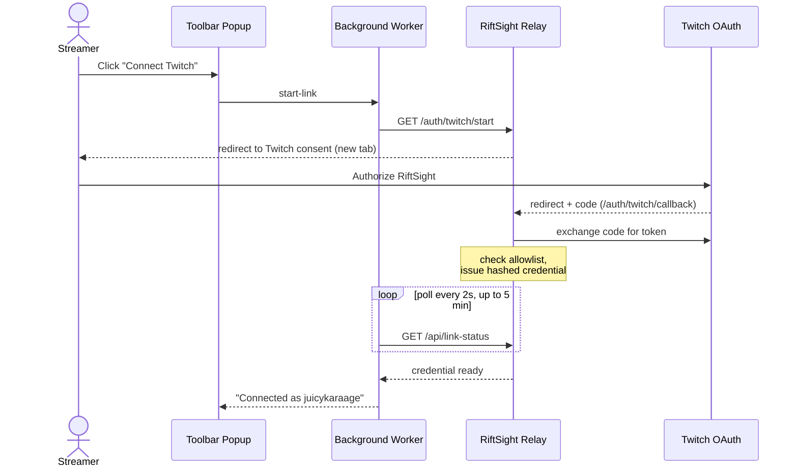

# RiftSight

RiftSight is a browser extension and Twitch overlay for [RiftAtlas](https://riftatlas.com) (a fan-made Riftbound TCG web client) which allows viewers to hover over cards during a RiftAtlas to see their details in real-time.

## Architecture

A streamer's browser extension reads card state directly off RiftAtlas's own page, relays it through RiftSight's backend, and a Twitch Extension iframe renders it as hover cards for every viewer — while card art itself is fetched by each viewer's browser straight from RiftAtlas's own CDN, never touching RiftSight's infrastructure at all.

```mermaid
flowchart LR
    Streamer(["🧑‍💻 Streamer"])

    subgraph RiftAtlas["🎮 RiftAtlas"]
        DOM["Game Board DOM"]
        AssetCDN["Asset CDN<br/>card art .webp"]
    end

    subgraph ExtBrowser["🖥️ Streamer's Browser<br/>RiftSight Extension"]
        Content["Content Script<br/>detects cards"]
        Background["Background Worker<br/>owns relay socket"]
    end

    subgraph Railway["☁️ RiftSight Relay — Railway"]
        ProducerWS["WS /ws/producer<br/>authenticated"]
        Sessions["Session<br/>latest state"]
        ViewerWS["WS /ws<br/>JWT-verified"]
    end

    subgraph TwitchPlatform["🟣 Twitch"]
        ExtHelper["Extensions Helper<br/>signs viewer JWT"]
    end

    CFPages["🌐 Cloudflare Pages<br/>viewer.html + main.js"]

    subgraph ViewerBrowser["👁️ Viewer's Browser"]
        ExtIframe["RiftSight Extension<br/>iframe"]
        Player["Twitch Player"]
    end

    Viewer(["👤 Viewer"])

    Streamer -->|plays| DOM
    DOM -.->|observes| Content
    Content -->|OverlayState| Background
    Background ==>|wss| ProducerWS
    ProducerWS --> Sessions
    Sessions ==>|state| ViewerWS
    ExtIframe <==>|subscribe w/ JWT ⇄ live state| ViewerWS
    ExtHelper -->|signs JWT| ExtIframe
    ExtIframe -.->|fetch art directly, bypasses relay| AssetCDN
    ExtIframe -->|loads from| CFPages
    Viewer -->|watches| Player
    Viewer -->|hovers card| ExtIframe

    subgraph VideoPath[" "]
        direction LR
        OBS["🎥 OBS"]
        VideoCDN["Twitch Video CDN<br/>RTMP → HLS"]
    end

    Streamer -->|captures| OBS
    OBS ==>|RTMP| VideoCDN
    VideoCDN ==>|HLS| Player

    classDef riftsight fill:#4c1d95,stroke:#a78bfa,color:#f5f3ff,stroke-width:1px
    classDef external fill:#1e293b,stroke:#64748b,color:#e2e8f0,stroke-width:1px
    classDef person fill:#78350f,stroke:#fbbf24,color:#fef3c7,stroke-width:1px
    classDef store fill:#312e81,stroke:#a5b4fc,color:#eef2ff,stroke-width:1px
    classDef invis fill:transparent,stroke:transparent

    class Content,Background,ProducerWS,ViewerWS,CFPages riftsight
    class DOM,AssetCDN,OBS,ExtHelper,VideoCDN,Player external
    class Streamer,Viewer person
    class Sessions store
    class VideoPath invis
```



*Purple = RiftSight's own components. Slate = third-party platforms (Twitch, RiftAtlas). Amber = people. Indigo = the relay's in-memory session state. Dashed lines mark connections that intentionally bypass RiftSight's backend entirely — card art is served directly from RiftAtlas's CDN to every viewer's browser, so image bandwidth never touches RiftSight's own infrastructure at all, no matter how many viewers are watching.*

The relay is deliberately a single Railway replica — its per-channel session state lives in memory, not a shared store, so a second replica would silently see a different, inconsistent world. SQLite (on a persistent volume) only holds what needs to survive a restart: linked broadcaster identities, the beta allowlist, and hashed producer credentials — never the live game state itself, which is republished fresh on every reconnect rather than persisted.

**Account linking** ("Connect Twitch" in the toolbar popup) is a separate, one-time OAuth flow, independent of the real-time pipeline above:



## Packages

- `extension/` — MV3 Chromium extension. Content script detects cards on the RiftAtlas board (`src/content/card-detector.ts`) and, optionally, publishes sanitized state (`src/content/publisher.ts`); a background service worker (`src/background/background.ts`) owns the relay connection.
- `protocol/` — shared, DOM-free types/validation/privacy-serializer/publisher used by both the extension and the debug viewer. Also home to `history.ts` (the binary-search state lookup + rolling time-window buffer shared by delayed-live and recording playback) and `recording.ts` (the recording data model, import validation, and `OverlayRecorder`).
- `relay/` — the RiftSight backend: one process, unified HTTP+WebSocket server. Its posture depends on mode (see "Closed beta" below) — in `development`/`twitch-local-test` the producer path is unauthenticated and everything is in-memory, matching the original local-prototype design; in `closed-beta` it additionally does Twitch OAuth account linking, persists broadcaster identity/allowlist/producer-credential state to SQLite (`relay/src/db/`), and requires an authenticated producer WebSocket. Live `OverlayState` itself is always in-memory-only in every mode — it only ever holds the single latest state per session, with no history. Delayed-live and recordings are entirely a debug-viewer-side concern (see "Viewer modes" below).
- `overlay-core/` — shared, DOM-free (no DOM lib in its `tsconfig.json`) card-hitbox/tooltip rendering geometry (`render.ts`, `tooltip.ts`), the delayed-live/recording-playback state-selection calculators (`mode.ts`), the broadcaster-calibrated source-region mapping (`source-region.ts` — see "Source-region calibration" below), and the platform-adapter seam (`platform.ts`'s `ViewerPlatformContext`/`OverlayStateSource`) shared between `debug-viewer` and `twitch-extension` without either depending on the other.
- `debug-viewer/` — static HTML/TS page that renders hoverable hitboxes over an optional screenshot or video background, in one of three modes (live / delayed-live / recording-playback — see below).
- `twitch-extension/` — the real Twitch video-overlay extension frontend, built for Twitch's Local Test workflow (see "Twitch overlay" below). Two entry points: `src/viewer/main.ts` (the video overlay itself) and `src/config/main.ts` (a minimal broadcaster configuration page). Both reuse `overlay-core`'s rendering/tooltip/delay logic — no card-rendering code is duplicated from `debug-viewer`.

## Setup

```bash
npm install
```

## Local workflow

1. **Build and load the extension.**
   ```bash
   npm run build -w extension
   ```
   Open `chrome://extensions`, enable Developer mode, **Load unpacked**, and select the `extension/` folder. If you change extension source, either re-run the build or use `npm run watch -w extension` and reload the extension in Chrome afterward.

2. **Start the relay.**
   ```bash
   npm run start -w relay
   ```
   Listens on `ws://localhost:8787` by default (override with `RELAY_PORT`). Three more env vars matter once a Twitch overlay is in the picture (see "Twitch overlay" below for the full Local Test walkthrough) — copy `relay/.env.example` to `relay/.env` (or `export` them directly) rather than committing real values:
   - `TWITCH_EXTENSION_CLIENT_ID` — your extension's client ID (currently used for logging only).
   - `TWITCH_EXTENSION_SECRET` — the extension's base64-encoded secret from the Twitch Developer Console. Required before the relay will accept any `twitch-subscribe`; without it, that path is refused outright rather than trusting an unverifiable token, and the relay logs a startup warning if it's unset. Never put this in source control.
   - `ALLOW_LOCAL_DEBUG` — set to `false` to disable the plain, unauthenticated `subscribe` path (used by the debug viewer and local-only testing) entirely. Defaults to enabled; recommended `false` once this relay is reachable through a public tunnel (see "Twitch overlay" below) — a tunneled relay is reachable by anyone with the URL, and the unauthenticated path becomes a real exposure, not just a local convenience.

3. **Start the debug viewer.**
   ```bash
   npm run dev -w debug-viewer
   ```
   Serves `debug-viewer/` at `http://localhost:8788`. (Run this in your own interactive terminal — esbuild's `--serve` mode watches stdin and exits if it's closed, which only matters for non-interactive/background shells.)

   Or, to run all three together:
   ```bash
   npm run dev
   ```

4. **Begin a scan.** In a RiftAtlas tab (a solo room is easiest — no opponent needed), open the floating "RiftSight Inspector" panel the content script injects. Under **Live Publishing**, confirm the session id (defaults to `local-debug`) and click **Start publishing**. The panel polls the background worker every 2s and shows the relay connection state and how many snapshots have been sent.

5. **Select a matching session.** The debug viewer reads its session from the `?session=` query param (or the input field, Enter to switch) — it must match what you set in the extension panel. Both default to `local-debug`, so if you haven't changed either, no action is needed.

6. **Add a screenshot (optional).** The stage works without one — it falls back to a plain CSS board background at a 16:9 aspect ratio so hitboxes always have something to render over. Two ways to add a real one: drop a full, uncropped screenshot of the RiftAtlas viewport at `debug-viewer/public/fixtures/riftatlas-game.png` (loaded automatically on page load if present), or use the **Screenshot** file picker in the viewer's header to load one from disk on the fly (kept local via an object URL — never uploaded or persisted; **Clear** returns to the fallback board). Either way, normalized coordinates only align correctly if the screenshot depicts the same full viewport (not cropped) and preserves its aspect ratio — the exact pixel dimensions don't need to match the extension's source viewport. A local video works the same way (own file picker, own Clear button) — see "Viewer modes" below. Video and screenshot are mutually exclusive backgrounds; whichever you loaded most recently is what's shown, and either one's Clear button returns to the fallback board (not to the other).

## Viewer modes

The mode selector in the debug viewer's second header row switches between three ways of deciding which `OverlayState` to render. Every state the viewer receives is buffered locally regardless of the active mode (a rolling ~60s window, keyed by `capturedAt`), so switching modes never requires waiting for history to reaccumulate.

- **Live** — renders whatever state just arrived. This is the original, unchanged behavior from the previous milestone.
- **Delayed-live** — renders what the board looked like `delay` ms ago, proving an overlay can compensate for stream latency. Set the delay (ms input or the 0/2/5/10s presets — takes effect immediately, no reload) and the **Status** readout shows **waiting for history** until at least `delay` ms of real collection time has actually elapsed since the page loaded (not just "is there some old sample lying around" — a reconnect can hand you the relay's one retained state from an arbitrarily long time ago, which must not be mistaken for continuous coverage), then **synchronized**.
- **Recording-playback** — replays an imported `OverlayRecording` in sync with a locally loaded video, using `targetOffsetMs = video.currentTime * 1000 + syncOffsetMs`. **Sign convention:** positive `syncOffsetMs` advances the overlay timeline ahead of the video; negative delays it (labeled `+ahead / -behind` next to the input). Adjust it with the ms input or the ±10/100/500ms step buttons. Status reads **before first recorded state** (an empty/waiting state — nothing renders) while the video is earlier than the recording's first state, **synchronized** while within range, or **past end of recording (holding last state)** once the video runs past the last recorded state (deliberately not cleared — the last known state is more useful than a blank overlay for a debug tool). Play/pause/seek/rate all work through the video element's native controls; pausing simply stops `timeupdate` from firing, so the last-rendered overlay just stays put with no special-case code needed.

### Recording a session

The **Recording** bar: **Start**/**Stop** capture every live state that arrives while active (skipping states that are semantically identical to the last recorded one, the same dedup the live publisher already does — so recording a completely idle board doesn't grow the file). **Export JSON** downloads the current recording as a local file (nothing is uploaded anywhere); **Import** loads a previously exported (or hand-written) recording from disk, validating it and normalizing out-of-order `offsetMs` values rather than rejecting them outright — a structurally invalid file (bad JSON, wrong `recordingVersion`, malformed states) is rejected with a specific error instead. **Clear** discards the current in-memory recording. All of this is in-browser only; there's no server-side recording storage anywhere in this repo.

### Manual test: record RiftAtlas + verify synchronized playback

1. Start the local stack (relay, debug viewer, extension loaded and pointed at a RiftAtlas tab).
2. Open RiftAtlas and the debug viewer side by side, matching session ids.
3. In the debug viewer's Recording bar, click **Start**.
4. Start a local screen recording of the RiftAtlas tab (any screen recorder).
5. Perform a few obvious, distinguishable actions in RiftAtlas: move a card, rotate it, turn it face down, move it to another zone.
6. Stop both recordings (the debug viewer's **Stop**, and your screen recorder).
7. Click **Export JSON** in the debug viewer and save the file.
8. Switch the debug viewer to **Recording playback** mode, load your screen recording via the **Video** file picker, and **Import** the JSON you just exported.
9. Adjust **Sync offset** (input or the ±10/100/500ms buttons) while watching the video-time / state-offset / diff readout, until the hitboxes visibly line up with the actions in the video.
10. Verify the hitboxes track each of the four actions from step 5 as the video plays.
11. Seek the video backward and forward — the overlay should update immediately (via the `seeked` event, not just `timeupdate`).
12. Change the video's playback rate — synchronization should keep working (the target-offset calculation only depends on `currentTime`, never on rate).
13. Confirm the overlay stays synchronized through all of the above without needing to touch the sync offset again.

## Twitch overlay (Local Test)

`twitch-extension/` is a Twitch video-overlay extension built for Twitch's **Local Test** workflow only — no public submission, no released hosting, no full streamer OAuth account linking. It's the first real Twitch-hosted frontend on top of the same relay/protocol everything else in this repo already uses.

```
RiftSight browser extension (streamer only)
  → relay (unchanged protocol, now with an authenticated subscribe path too)
    → twitch-extension/src/viewer (Twitch-hosted iframe)
      → hoverable card regions over the Twitch channel's video
```

A viewer never installs anything — only the streamer runs the RiftSight browser extension. Twitch loads the video-overlay extension automatically for anyone watching a channel where it's been activated.

### Architecture at a glance

- **Reused directly, unchanged:** `protocol/` (types, schema, `TimeWindowBuffer`/`findStateAtOrBefore`) and `overlay-core/` (`computeHitboxStyle`, `tooltipContentFor`, `delayedLiveTarget`/`isWaitingForHistory`, `mapBoundsToSourceRegion`). The debug-viewer's own screenshot/video-background machinery and its 3-way live/delayed-live/recording-playback mode selector are **not** reused — Twitch supplies the video itself, and there's no recording-playback mode here.
- **Twitch-specific, lives only in `twitch-extension/`:** the Extension Helper integration (`onAuthorized`, token refresh, `src/twitch-ext.d.ts`), the `TwitchOverlayStateSource`/`MockOverlayStateSource` implementations of `overlay-core`'s `OverlayStateSource`, the broadcaster config page, and all iframe/CSP-facing HTML.
- **`ViewerPlatformContext` / `OverlayStateSource`** (`overlay-core/src/platform.ts`) is the seam: the shared rendering code only ever asks for a stream of `OverlayState`, never for `window.Twitch` directly — so `debug-viewer` keeps working exactly as before, untouched by any of this.

### Backend authentication

The relay now accepts two kinds of viewer subscription:

- `{ type: "subscribe", sessionId }` — the original, unauthenticated path (`local-debug`, the debug viewer). Gate it off entirely with `ALLOW_LOCAL_DEBUG=false` if you want a posture closer to production.
- `{ type: "twitch-subscribe", channelId, token }` — verifies `token` as a real Twitch Extension JWT (HS256, against the base64-decoded `TWITCH_EXTENSION_SECRET`) and only admits the viewer if the JWT's own `channel_id` claim matches the requested `channelId` — the browser-supplied `channelId` is never trusted on its own. See `relay/src/twitch-auth.ts` and `relay/src/server.ts`.

The RiftSight browser extension's publishing side needs no changes: `sessionId` was already an arbitrary string end-to-end, so a Twitch channel ID is just another value for that same field (see the extension panel's "Session ID (or Twitch test channel ID)" label). **Never commit a personal channel ID to source control** — type it in locally each session.

### Relay URL configuration

`twitch-extension`'s viewer/config pages don't hardcode a relay address the way `debug-viewer`/`extension` still do (`protocol/src/config.ts`'s `RELAY_URL` — untouched, still `ws://localhost:8787`, still what mock mode defaults to for convenience). Instead, `RIFTSIGHT_RELAY_URL` is baked into the `twitch-extension` bundle at **build time** by `twitch-extension/build.mjs` (via esbuild's `define`, read from `process.env.RIFTSIGHT_RELAY_URL` — no dotenv auto-loading, `export` it or copy `twitch-extension/.env.example` to `.env` and `source` it yourself before building). Rebuild whenever this value changes; it's not read live.

- **Missing in real Twitch mode** → the viewer fails fast with a clear on-screen diagnostic (`"RIFTSIGHT_RELAY_URL is not configured..."`) rather than silently doing nothing.
- **`ws:` instead of `wss:` while served from a secure context** (real Twitch pages always are) → also fails fast with a clear diagnostic, rather than letting the browser silently block it as mixed content.
- **Mock mode** (`index.html`/`config-mock.html`) ignores all of this and always defaults to localhost, exactly as before.
- Both `viewer.html` and `config.html` are built from the same `build.mjs` invocation, so they always share the same configured endpoint.

### Source-region calibration

RiftSight publishes card bounds normalized relative to the **RiftAtlas viewport**, not the final stream canvas — that never changes, at the producer, protocol, or recording layers. If RiftAtlas doesn't fill the entire stream (a side panel, letterboxing, a centered capture with borders), the Twitch overlay needs a second transform: a broadcaster-calibrated `SourceRegion` (`overlay-core/src/source-region.ts`) describing exactly where RiftAtlas sits within the stream canvas, normalized 0–1. `mapBoundsToSourceRegion(cardBounds, sourceRegion)` — pure, DOM-free, unit-tested — applies `mappedX = region.x + cardBounds.x * region.width` (and the equivalent for y/width/height) in `viewer/main.ts`'s `renderHitboxes()`, right before computing CSS position; nothing else in the pipeline (state selection, delay, recording) is aware this transform exists.

**This is direct rectangular mapping only.** The broadcaster must select the exact final rectangle RiftAtlas is displayed in — there's no automatic contain/cover/crop-edge/letterbox/perspective correction, and no OBS integration or computer-vision detection. If the calibrated rectangle doesn't match reality, hitboxes will be uniformly offset/scaled wrong rather than corrected.

**Calibrating it:** open the broadcaster configuration page (`config.html`, or `config-mock.html` for local testing) — redesigned as a short setup flow rather than a flat control list, since the calibration step is the one thing every broadcaster actually has to get right before going live:
- **Step 1 — "Where does RiftAtlas appear on your stream?"** is first and most prominent. **Layout presets** (Full screen / Left side / Right side / Centered) cover the common cases in one click; a **reference-screenshot dropzone** (file picker, drag-and-drop, or paste from the clipboard) shows an image of your actual stream output behind the region box so you can align by eye against your real composition instead of guessing blind — loaded via `URL.createObjectURL`, stays entirely in the browser tab, never uploaded or persisted, gone on the next page load. If RiftAtlas fills the whole canvas, **Full screen** needs no screenshot at all. Below that, a large **visual preview** (aspect-ratio follows the aspect-ratio override when one is set, else 16:9) shows a draggable/resizable "RiftAtlas area" rectangle with a live card-hitbox preview inside it — sourced from the channel's actual latest live state when available, falling back to example fixture cards otherwise, and **always visible regardless of the debug-outlines setting** (only the real on-stream outlines are gated by that toggle — the calibration preview itself isn't). A hidden card in the preview only ever shows as "Hidden card", the same privacy guarantee as the real overlay.
- **Step 2 — "Match your stream delay"** — None / 2s / 5s / 10s / Custom pills, in seconds; still stored as `delayMs` internally.
- **Step 3 — "Choose card popup size"** — a labeled slider (Smaller / Default / Larger) with a live preview of both the portrait and landscape (battlefield-type) popup sizes.
- **Advanced settings** (collapsed by default): Overlay enabled, "Show hitbox outlines to viewers" (a page-level warning banner appears the instant this is checked — outlines are visible to every viewer, not just you), the RiftAtlas window aspect-ratio override, and a nested **Exact values** disclosure with the numeric x/y/width/height fields as an always-available, authoritative fallback. An invalid value (e.g. one that would push the region outside the frame) reverts to the last valid one rather than saving something broken.
- A sticky **save bar** shows Unsaved changes / Saving… / Saved (with a quieter timestamp) / Could not save, and de-emphasizes Save when there's nothing to save.

Saving applies to the config's `sourceRegion` field alongside `overlayEnabled`/`delayMs`/`debugOutlines`/`sourceAspectRatio` — same persistence path (`configuration.set`/`configuration.broadcaster`), same live-update path (`configuration.onChanged`, no viewer reload needed), and the same backward-compatible default: a config saved before `sourceRegion` existed (or a corrupted one) parses to full frame, so every existing channel keeps behaving exactly as before this milestone.

The aspect-ratio diagnostic (`checkAspectRatioMismatch`, debug-mode only) now compares RiftAtlas's own source aspect ratio against **the calibrated region's own rendered aspect ratio** — `(stage width × region.width) / (stage height × region.height)` — rather than the full stage's aspect ratio, since the region may only cover part of the canvas.

### Mock mode (develop without Twitch)

Because iterating entirely inside Twitch's Local Test loop is slow, `twitch-extension/index.html` is a local mock harness that runs the *exact same* `src/viewer/main.ts` bundle Twitch would load, minus `window.Twitch` — it sets `window.__RIFTSIGHT_MOCK__ = true` before the script runs, which switches to `MockOverlayStateSource` (plain, unauthenticated relay subscribe, channel id typed into a text field) instead of `TwitchOverlayStateSource`. It also has its own delay controls, debug-outline toggle, and optional screenshot/video background for alignment testing (the video-background option is mock-harness-only; the screenshot-background option also exists on the real Twitch-hosted `config.html`, see "Calibrating it" above). `config-mock.html` is the same idea for the broadcaster config page — it saves to `localStorage` instead of Twitch's configuration service.

```bash
npm run dev -w twitch-extension
```
Serves `twitch-extension/` at `http://localhost:8789` — open `index.html` for the overlay mock harness, `config-mock.html` for the config page mock harness, and `viewer.html`/`config.html` for the real Twitch-hosted pages (only meaningful once actually loaded inside Twitch — see below).

### Why a plain localhost setup doesn't work

Twitch's extension supervisor — the page that actually embeds `viewer.html`/`config.html` in an iframe when you activate Local Test — is a **public origin**. Modern Chrome (142+ on desktop; WebSocket/WebTransport specifically since Chrome 147) and Firefox both enforce **Local Network Access** (formerly Private Network Access): a public page is blocked from embedding an iframe at, or opening a WebSocket to, `localhost`/a private IP/`.local` without an explicit permission grant — and even then, a *nested* iframe additionally needs its parent frame to set `allow="local-network-access"`, which Twitch's supervisor doesn't do (nor should it, generally — this is a deliberate anti-drive-by-LAN-attack browser protection, not a bug). That's exactly what you'd see:

- Opening `https://localhost:8443/viewer.html` **directly** (typing the URL in yourself) works fine and correctly shows "Waiting for Twitch authorization" — that's a top-level navigation, not a cross-origin embed, so Local Network Access doesn't apply. It only proves the file is reachable, not that auth works.
- Twitch's iframe **embedding** the same URL is what actually gets blocked — Firefox surfaces this as `NS_ERROR_LOCAL_NETWORK_ACCESS_DENIED`; Chrome fails the request silently or shows only provisional headers. The document never loads, so the Twitch Extension Helper script inside it never executes, `onAuthorized` never fires, and Twitch reports "Extension Helper Library Not Loaded" — a downstream symptom, not the cause.
- The same restriction applies to WebSockets: even after fixing asset loading, a `ws://localhost:8787` relay is unreachable from Twitch's real iframe for the identical reason, plus it's mixed content against an HTTPS page regardless.

**The fix**: serve Twitch-facing assets and the relay from genuinely public HTTPS/WSS origins — nothing "local" from the browser's perspective. A development tunnel (Cloudflare Tunnel, ngrok, or similar) is the fastest way to get one without permanent hosting.

### Local Test setup (public tunnel workflow)

This needs an actual Twitch Developer account, a real extension registered in the [Extensions Developer Console](https://dev.twitch.tv/console/extensions), and `cloudflared` installed (or `ngrok` — any tool that exposes a local HTTP(S) origin publicly works; the app itself isn't coupled to one vendor, this just documents one path). The exact console UI (button labels, tab names) changes over time — treat the steps below as a map, not a script.

**Two tunnels, not one** — the asset server and the relay stay two separate local processes with two separate public URLs. A unified single-origin gateway wasn't built this round: the relay's `WebSocketServer` construction would need real changes to also serve static files, for a workflow-only problem — `RIFTSIGHT_RELAY_URL` does support a path segment (e.g. `wss://host/relay`) if a future unified gateway ever needs one.

**This means 5 things need to be running at once, each in its own terminal** (a quick-tunnel process blocks its terminal for as long as you want the URL to stay alive, so each one needs a dedicated window): the asset server (step 1), the asset tunnel (step 2), the relay (step 3), the relay tunnel (step 4), and — only transiently, to pick up a new `RIFTSIGHT_RELAY_URL` — a rebuild (step 5), which can reuse the same terminal you ran step 1's build in, since it exits when done rather than staying attached.

1. Build the Twitch frontend and start the local static asset server (plain HTTP now — no cert needed, since the tunnel terminates HTTPS for you):
   ```bash
   npm run dev:twitch:build
   npm run dev:twitch:assets
   ```
2. In a second terminal, tunnel it publicly:
   ```bash
   cloudflared tunnel --url http://localhost:8443
   ```
   Note the `https://<random>.trycloudflare.com` URL it prints.
3. In a third terminal, set the required relay environment variables (copy `relay/.env.example` to `relay/.env`, or `export` them) — at minimum `TWITCH_EXTENSION_SECRET`; recommend also setting `ALLOW_LOCAL_DEBUG=false` now that this relay is about to be tunneled publicly. Start it:
   ```bash
   npm run dev:twitch:relay
   ```
4. In a fourth terminal, tunnel the relay too:
   ```bash
   cloudflared tunnel --url http://localhost:8787
   ```
   Note this second `https://<random>.trycloudflare.com` URL — used as `wss://<that-host>` in the next step. **Don't `curl` this one expecting `200` the way you did the asset tunnel in step 8** — the relay only understands the WebSocket upgrade handshake, so a plain `curl -I` against it correctly returns `426 Upgrade Required`. That's actually confirmation the tunnel *is* reaching your relay (a connection failure, timeout, or 502 would mean it isn't) — a `200` here would be the surprising result, not the `426`.
5. Set `RIFTSIGHT_RELAY_URL=wss://<relay-tunnel-host>` (copy `twitch-extension/.env.example` to `.env`, or `export` it) and **rebuild** — `RIFTSIGHT_RELAY_URL` is baked in at build time, so re-run `npm run dev:twitch:build` whenever this value changes. The already-running `dev:twitch:assets` server will pick up the new `dist/` output on the next request without needing a restart.
6. In the extension's **Asset Hosting** tab, set the Testing Base URI to the *asset* tunnel's HTTPS URL from step 2 (must end with a trailing slash, e.g. `https://<asset-tunnel-host>/`), the Video Overlay viewer path to `viewer.html`, and the config path to `config.html`.
7. On the extension's **Capabilities** tab, enable the **Extension Configuration Service** (required for `config.html`'s `configuration.set`/`configuration.broadcaster` calls to work at all).
8. Confirm the public asset URL actually serves the app: `curl -I https://<asset-tunnel-host>/viewer.html` should return `200`. Opening it directly in a browser is expected to show "Waiting for Twitch authorization" — that's the static-asset check, not an auth check (see above).
9. Start the RiftSight browser extension pointed at a RiftAtlas tab (see "Local workflow" above). In its floating panel, set **Session ID (or Twitch test channel ID)** to your actual numeric Twitch channel ID and click **Start publishing**.
10. In the Developer Console, put the extension into **Local Test**, then activate it on your test channel (as a Video Overlay).
11. Open your channel on Twitch as a viewer — a different browser profile or incognito window is the honest way to confirm no RiftSight extension is needed there.
12. Confirm: the extension authorizes (no "waiting for Twitch authorization" diagnostic stuck on screen), the relay logs a `twitch-subscribe` admitted for your channel, and card hitboxes appear over the video, tracking whatever's happening in RiftAtlas after your configured delay. Toggle **Debug outlines** on via `config.html` to see the staged connection diagnostics panel if anything looks wrong (see "Troubleshooting" below).
13. Open **config.html** (via the extension's own config UI entry point in the console/dashboard) to adjust delay/debug-outlines/source-region/source-aspect-ratio — changes apply to open viewers immediately, no reload.

**Quick-tunnel URLs are temporary** — `cloudflared tunnel --url` (without a named/authenticated tunnel) mints a new random hostname every time it starts. Whenever you restart either tunnel, update: the Testing Base URI in the Developer Console (asset tunnel) and `RIFTSIGHT_RELAY_URL` + rebuild (relay tunnel).

### Troubleshooting

| Symptom | Likely cause |
|---|---|
| `viewer.html` never requested (no entry in `dev:twitch:assets`'s or the tunnel's logs) | Testing Base URI is wrong, missing the trailing slash, or the extension isn't actually in Local Test / activated on the channel yet. |
| Firefox `NS_ERROR_LOCAL_NETWORK_ACCESS_DENIED`, or Chrome's iframe request never completes | Testing Base URI still points at `localhost` — Local Network Access blocks it (see above). Switch to a public tunnel URL. |
| Twitch reports "Extension Helper Library Not Loaded" | Downstream of the above — the iframe document never loaded, so the Helper script tag inside it never ran. Fix asset loading first. |
| `onAuthorized` never fires, even though the iframe loads | Usually the Extension Configuration Service capability isn't enabled, or the extension isn't actually activated on the channel you're viewing as. |
| Browser console shows a mixed-content/WebSocket rejection | `RIFTSIGHT_RELAY_URL` is `ws://` instead of `wss://`, or points at a `localhost` address — `resolveRelayUrl` should have already caught this at build/run time with a visible diagnostic; check the debug-outlines-gated diagnostics panel. |
| Relay stays at zero viewers | Check the relay's own logs: `[relay] socket connected` should appear when the tunnel is reachable at all; if it's missing, the relay tunnel URL or `RIFTSIGHT_RELAY_URL` is wrong. |
| Relay logs a JWT rejection | `TWITCH_EXTENSION_SECRET` is wrong, unset, or not base64-decoded correctly — double check it's the Extension *shared* secret from the console, not your API Client Secret. |
| Relay logs a channel-ID mismatch | The publisher's Session ID (in the RiftSight extension panel) doesn't match the numeric channel ID Twitch actually authorized the viewer for — retype it exactly. |
| Everything worked yesterday, nothing connects today | Quick-tunnel URLs rotate on every restart — update the Testing Base URI and/or `RIFTSIGHT_RELAY_URL` (+ rebuild) to match the tunnels' current URLs. |
| `curl -I` on the *relay* tunnel returns `426 Upgrade Required` | Expected, not a bug — the relay only understands the WebSocket upgrade handshake, so a plain GET is correctly rejected this way. This actually confirms the tunnel is reaching your relay; a connection failure/timeout/502 would mean it isn't. Don't apply the asset tunnel's "should return 200" check to this one. |
| The RiftSight extension's own floating panel (in the RiftAtlas tab) shows "Relay: disconnected" | This is a **different connection** from everything else in this section — the extension always talks to `ws://localhost:8787` directly, on the same machine, and never touches either tunnel or `RIFTSIGHT_RELAY_URL`. This means no relay process is actually reachable on your machine's port 8787 at all: check that the terminal running `npm run dev:twitch:relay` is still open and shows `[relay] listening on ws://localhost:8787`, and that nothing else is already bound to that port (`lsof -i :8787`). |

### Manual acceptance test

1. Build the Twitch frontend (`npm run dev:twitch:build`).
2. Start the local relay/gateway with Twitch credentials (`npm run dev:twitch:relay`, with `TWITCH_EXTENSION_SECRET` set).
3. Start a public HTTPS/WSS tunnel for both the asset server and the relay.
4. Configure the generated public asset URL as Twitch's Testing Base URI.
5. Configure the Twitch frontend to use the public WSS relay URL (`RIFTSIGHT_RELAY_URL`, rebuild).
6. Confirm the public `/viewer.html` returns `200` (`curl -I`).
7. Activate the Local Test extension on the broadcaster's channel.
8. Start an OBS stream (or just have RiftAtlas open and visible — a real stream isn't required to validate the RiftSight-specific parts of this).
9. Start RiftSight publishing under the numeric Twitch channel ID.
10. Watch from an authorized test account without RiftSight installed.
11. Confirm: the viewer iframe loads, the Helper initializes, `onAuthorized` fires, the relay's WSS connection is established, the relay admits the `twitch-subscribe`, the relay's viewer count goes from zero to one, and card hitboxes update after the configured delay.

### Manual test: source-region calibration layouts

Run against `viewer.html`/`config.html` (or the mock harnesses, for iterating without Twitch). For each layout: check normal player size, a resized window, zero and nonzero delay, a rotated card, two overlapping cards, and a public + a hidden card together.

- **Full frame** (`{x:0,y:0,width:1,height:1}`, the default) — behavior is unchanged from before this milestone: hitboxes map 1:1 to RiftAtlas-relative bounds.
- **Right-side layout** (e.g. `{x:0.25,y:0,width:0.75,height:1}`, RiftAtlas occupying the right 75%) — hitboxes shift and scale into that region; nothing renders with `left` below the region's own `x`.
- **Centered layout** (e.g. `{x:0.1,y:0.1,width:0.8,height:0.8}`, the "Centered" preset, borders on all sides) — hitboxes align inside the centered rectangle, none bleeding into the border margins.

All three were exercised live against the real bundle (a stubbed `window.Twitch.ext` + a real relay + real signed JWTs, the same technique used throughout this milestone) with rotated and overlapping public/hidden cards, confirming: mapped positions match `mapBoundsToSourceRegion`'s formula exactly, rotation composes correctly on top of the mapping, hidden cards never leak identity, hitboxes stay percentage-correct across a window resize with no special resize code, and delay/region are independent (an unsatisfiable delay shows nothing regardless of a valid region; resetting delay to 0 brings cards back at the same correctly-mapped positions). Theater mode and fullscreen specifically need a real Twitch iframe to exercise, but rely on the exact same CSS-percentage mechanism already confirmed to be resize-agnostic — see "Iframe/player resizing" in the architecture notes above.

### Known Twitch-specific limitations

- **CSP/hosting:** all assets must be servable under Twitch's iframe sandbox and HTTPS/WSS. `twitch-extension`'s relay URL is configurable via `RIFTSIGHT_RELAY_URL` (build-time, see "Relay URL configuration" above); `debug-viewer`/`extension` still use `protocol/src/config.ts`'s hardcoded `ws://localhost:8787`, unchanged, since those are local-only tools this milestone deliberately didn't touch. No extension secret is ever bundled into any frontend — `relay/src/twitch-auth.ts` is relay-only, and a regression test (`twitch-extension/src/build-security.test.ts`) asserts it never leaks into the built bundles even if it happens to be present in the build environment.
- **Two separate tunnels, not one unified origin:** the asset server and the relay are two independent local processes with two independent public URLs — see "Local Test setup" above for the reasoning (a single-origin gateway would need real changes to the relay's WebSocket server construction for a workflow-only problem). `RIFTSIGHT_RELAY_URL` does support a path segment (e.g. `wss://host/relay`) if a future unified gateway ever needs one.
- **Quick tunnels are temporary:** `cloudflared tunnel --url` (no named/authenticated tunnel) mints a new hostname on every restart — both the Twitch Developer Console's Testing Base URI and `RIFTSIGHT_RELAY_URL` need updating (and a rebuild) whenever a tunnel restarts.
- **Debug outlines are channel-wide, not per-viewer:** the broadcaster config's `debugOutlines` flag applies to every viewer of that channel while it's on (there's no per-viewer-role gating beyond "off by default until the broadcaster explicitly turns it on") — turn it off after you're done testing alignment.
- **Source-region calibration is direct rectangular mapping only, manually set:** no automatic OBS scene-region calibration, no computer-vision board detection, no automatic latency detection, and no contain/cover/crop-edge/letterbox/perspective correction — the broadcaster must select the exact rectangle RiftAtlas occupies. `checkAspectRatioMismatch` only warns (in debug mode) when the RiftAtlas source aspect ratio and the calibrated region's own rendered aspect ratio drift apart beyond a small tolerance; it never corrects anything.
- **The calibration preview's own reference frame is a fixed 16:9 box**, not independently configurable — a broadcaster whose actual canvas isn't 16:9 still calibrates by eye, though a dropped-in reference screenshot (see "Calibrating it" above) makes that eyeballing accurate against their real composition rather than against blank space.

## Closed beta

The Local Test workflow above is developer-operated: temporary tunnels, a hand-typed numeric Twitch channel ID, no auth on the producer side, nothing persisted across a restart. **Closed beta** is the same relay/protocol, hardened and extended so another RiftAtlas streamer (not you) can use it without running anything themselves — no tunnels, no manual channel ID, no terminals. It's still not a public release: onboarding is manual, capped at roughly 3–10 streamers.

Once you're operating a deployed closed-beta backend day to day (adding streamers, checking logs, rotating a credential, restarting, backing up the database), see **[docs/operator-runbook.md](docs/operator-runbook.md)** — this section covers the architecture and one-time setup; the runbook covers the recurring operational tasks.

```
RiftSight browser extension
    │  "Connect Twitch" → OAuth identity, then a producer credential
    │  authenticated producer WebSocket (/ws/producer?credential=...)
    ▼
RiftSight backend (relay/, one process)
    ├── Twitch OAuth account linking       (auth/twitch-oauth.ts, http/routes/auth-twitch.ts)
    ├── closed-beta allowlist + broadcaster identity (db/, persistent — see below)
    ├── producer credential issuance/rotation (db/producer-credentials.ts)
    ├── authenticated producer + viewer WebSocket fan-out (server.ts)
    └── /health, /ready                     (http/routes/health.ts)
          │  authenticated viewer subscription (twitch-subscribe, unchanged from Local Test)
          ▼
    Twitch video-overlay extension (twitch-extension/)
```

### Environment modes

Set via `RIFTSIGHT_MODE` (relay and extension both read it; twitch-extension doesn't need it — it only ever talks to whatever `RIFTSIGHT_RELAY_URL` says). One of:

- **`development`** (default) — today's Local Test-adjacent behavior: unauthenticated `local-debug` sessions stay enabled, the manual session-ID field stays in the extension panel, missing secrets only warn at startup.
- **`twitch-local-test`** — the tunnel workflow described above: real Twitch Extension JWT verification is exercised, local-debug diagnostics remain available too.
- **`closed-beta`** — stable-deployment mode: `local-debug` is force-disabled regardless of `ALLOW_LOCAL_DEBUG`, the extension's manual session-ID field is hidden in favor of "Connect Twitch," the plain unauthenticated producer path is rejected outright (`producerAuth.required`), and the relay **refuses to start** if any secret in `relay/src/env.ts`'s `REQUIRED_IN_CLOSED_BETA` is missing.

### Environment variables

**`relay/`** (copy `relay/.env.example` to `.env`, or `export` directly):

| Variable | Required in | Purpose |
|---|---|---|
| `RIFTSIGHT_MODE` | — | `development` \| `twitch-local-test` \| `closed-beta`. Defaults to `development`. |
| `PORT` / `RELAY_PORT` | — | `PORT` takes precedence if both are set (most platforms — Fly.io, Railway, Render — inject `PORT`). Defaults to `8787` if neither is set. |
| `RIFTSIGHT_DB_PATH` | closed-beta | A libsql client URL. Defaults to a local file at `relay/data/riftsight.db` outside closed-beta. **Required** in closed-beta (no silent ephemeral-storage default), and `:memory:` is rejected outright there too — the process refuses to start rather than boot into a mode that loses all data on every restart. `:memory:` remains fine in `development`/`twitch-local-test`. |
| `TWITCH_EXTENSION_CLIENT_ID` | — | Logging/diagnostics only. |
| `TWITCH_EXTENSION_SECRET` | closed-beta | Extension shared secret (base64), from the Developer Console. Verifies viewer `twitch-subscribe` JWTs. **Not** your API Client Secret — see "Don't confuse these" below. |
| `ALLOW_LOCAL_DEBUG` | — | `"false"` disables the plain unauthenticated viewer `subscribe` path. Force-disabled in closed-beta regardless of this value. |
| `TWITCH_API_CLIENT_ID` / `TWITCH_API_CLIENT_SECRET` | closed-beta | Twitch API app credentials for the "Log in with Twitch" OAuth flow (streamer account linking) — a **separate** Developer Console app registration from the Extension above. Client Secret is relay-only, never in any frontend. |
| `TWITCH_OAUTH_REDIRECT_URI` | closed-beta | Must exactly match a redirect URI registered for the Twitch API app. `http://localhost:…` is fine in development; closed-beta requires `https:`. |

**`extension/`** (copy `extension/.env.example` to `.env` — build-time only, rebuild after changing):

| Variable | Purpose |
|---|---|
| `RIFTSIGHT_MODE` | Same three values as above. Only `closed-beta` hides the manual session-ID field. |
| `RIFTSIGHT_BACKEND_URL` | The RiftSight backend's public origin (same service as `relay/` above) — used for `/auth/twitch/start` and `/api/link-status`. Defaults to `http://localhost:8788`. |

**`twitch-extension/`** (copy `twitch-extension/.env.example` to `.env` — build-time only): unchanged from the Local Test workflow — `RIFTSIGHT_RELAY_URL`, now simply pointed at the closed-beta backend's public `wss://` origin instead of a temporary tunnel.

**Don't confuse these** (four separate credential concepts, each touched by exactly one module): the **Twitch API Client Secret** (`auth/twitch-oauth.ts`, identifies the streamer once via OAuth) vs. the **Twitch Extension shared secret** (`twitch-auth.ts`, verifies viewer JWTs) vs. a **Twitch Extension JWT** (short-lived, issued by Twitch to a viewer's session, verified per-connection, never stored) vs. RiftSight's own **producer credential** (`auth/producer-credential.ts`, an opaque token scoped to one broadcaster, stored in the extension, revocable via the allowlist).

### Persistence and the closed-beta allowlist

SQLite via `@libsql/client` (see `relay/src/db/`) — the right size for one backend instance and 3–10 streamers, with room to point the same client API at a hosted libsql/Turso database later without an application-code change. Schema migrations are hand-rolled (`relay/src/db/migrate.ts` + `migrations/*.sql`) and applied automatically at every boot (idempotent — a no-op once current) as well as via a standalone command. No Twitch Extension JWTs or plaintext secrets are ever persisted — only broadcaster identity, allowlist membership, and a SHA-256 hash of each producer credential (the raw token is shown exactly once, at issuance).

```bash
npm run migrate -w relay                              # apply pending migrations without starting the server
npm run seed-allowlist -w relay -- add <twitchUserId> [note...]
npm run seed-allowlist -w relay -- remove <twitchUserId>   # revokes their producer credential on their next connection attempt
npm run seed-allowlist -w relay -- list
```

A Twitch user ID (numeric), not a display name — find it via any Twitch user-ID lookup tool, or have the streamer attempt to link once and check the relay's `oauth_link_rejected`/403 log line, which includes it.

### Deployment

Provider-agnostic by construction: one Node process, environment-variable secrets, a local file path for SQLite. Two options that both provide stable HTTPS+WSS, secret management, a persistent volume, and straightforward redeploy:

1. **Railway** (the chosen closed-beta target) — GitHub-integration auto-deploy from the repo-root `Dockerfile`, built-in HTTPS+WSS via a generated domain, a persistent volume, dashboard-based secrets, a `/ready`-gated health check, single-replica by config (this backend's local SQLite + in-memory session state cannot run multi-replica — see below). First-class support: [`railway.json`](railway.json) plus a full step-by-step guide at **[docs/railway-deployment.md](docs/railway-deployment.md)** (project creation, volume mount, every env var, obtaining and wiring in the public domain, redeploy/restart/rollback/backup/restore). Render is architecturally equivalent if you'd rather use it, though the setup guide here is Railway-specific.
2. **Fly.io** — a Fly Machine running the built `relay/` process; Fly's edge proxy terminates HTTPS/WSS natively; a small Fly Volume holds the SQLite file (`RIFTSIGHT_DB_PATH=file:/data/riftsight.db` pointed at the mounted volume); `fly secrets set` for every secret above; `fly deploy` from a Dockerfile. More infrastructure control, more setup ceremony; no dedicated setup guide in this repo (Railway is the chosen target — this option stays provider-agnostic-by-construction, not further documented).

Not automatically wired up or deployed by anything in this repo — choosing and configuring a provider is a deliberate operator step. The repo-root `Dockerfile` (Node 20-alpine, runs `relay/` from source via `npx tsx` — no separate build step, matching `npm run start -w relay`) is what both options above build from:

```bash
docker build -t riftsight-relay .
docker run -p 8787:8787 --env-file relay/.env riftsight-relay
```

```bash
# Build (each has its own build step; protocol/relay/overlay-core run from source)
npm run build -w extension          # producer-side browser extension (unpacked, load from extension/)
npm run build -w twitch-extension   # viewer/config pages — respects RIFTSIGHT_RELAY_URL at build time
npm run package -w twitch-extension # build + write twitch-extension/deploy/ (the exact files to upload
                                     # to your stable asset origin — see "Stable asset hosting" below)

# Database migration (idempotent — also runs automatically at every relay boot, see above)
npm run migrate -w relay

# Startup
npm run start -w relay              # tsx src/index.ts — reads RIFTSIGHT_MODE and every var above from the environment
```

**Health checks:** `GET /health` (process is up) and `GET /ready` (process is up *and* the database actually responds to a query) — point your platform's health-check config at `/health` for liveness and `/ready` for readiness/traffic admission if it distinguishes the two, otherwise `/health` alone is sufficient for a single-instance beta.

**Graceful shutdown:** the relay handles `SIGTERM`/`SIGINT` by closing the WebSocket server, then the HTTP server, then the database, with a 10s force-exit fallback if anything hangs — safe to redeploy without special draining logic on your platform's side.

**Rollback:** this backend has no destructive migrations (every migration so far only adds tables/columns) and no versioned wire-protocol break, so rolling back to a previous deploy of `relay/` is safe without a corresponding down-migration — the schema a newer version added simply goes unused by an older one. Keep the previous build artifact/image available on whatever platform you choose so a rollback is "redeploy the last known-good image," not a rebuild under pressure.

**Secret rotation:** every secret above is read from the environment at process startup only (no in-memory caching that would need an explicit reload) — rotate a secret in your platform's secret manager, then restart the process; no rebuild needed (this was an explicit design goal, unlike `twitch-extension`'s `RIFTSIGHT_RELAY_URL`, which *is* build-time and does need a rebuild if the origin itself changes, not just a stream of the same origin). A single broadcaster's own producer credential is rotated independently via `POST /api/producer-credential/rotate` (bearer-authed with their current credential) — no backend restart needed for that.

**Closed-beta deployment checklist:**
- [ ] `relay/` deployed with `RIFTSIGHT_MODE=closed-beta` and every var in `REQUIRED_IN_CLOSED_BETA` set (the process refuses to start otherwise — check its startup logs).
- [ ] `RIFTSIGHT_DB_PATH` points at a path on a **persistent** volume, not ephemeral container storage.
- [ ] `TWITCH_OAUTH_REDIRECT_URI` is `https:` and exactly matches what's registered in the Twitch API app.
- [ ] `npm run migrate -w relay` has been run at least once against the target database (or trust the automatic at-boot migration on first start).
- [ ] `twitch-extension` built with `RIFTSIGHT_RELAY_URL=wss://<your-backend-host>` (the same host as the relay above) and `npm run package -w twitch-extension`'s `deploy/` output uploaded to your stable HTTPS asset origin.
- [ ] That asset origin entered as the Twitch Developer Console's Testing Base URI for the closed-beta version.
- [ ] `extension/` built with `RIFTSIGHT_MODE=closed-beta` and `RIFTSIGHT_BACKEND_URL=https://<your-backend-host>`.
- [ ] `extension/manifest.json`'s `host_permissions` includes the real backend origin (it only lists `http://localhost:8788/*` by default — add the deployed origin before packaging).
- [ ] At least one Twitch user ID added via `seed-allowlist add`.
- [ ] `curl -I https://<backend-host>/health` returns `200`.
- [ ] Deployed at **exactly one replica**, with `RIFTSIGHT_DB_PATH` pointed at a real mounted persistent volume — this backend's local SQLite and in-memory live session state cannot run correctly (or at all) across more than one replica. On Railway specifically, see [docs/railway-deployment.md](docs/railway-deployment.md) for the volume-creation and `railway.json`'s `numReplicas: 1` steps.

### Stable asset hosting

`npm run package -w twitch-extension` builds and writes `twitch-extension/deploy/` — `viewer.html`, `config.html`, and their bundles only (never the local mock harness, `index.html`/`config-mock.html`, which don't belong on a real Twitch-facing origin). Upload that directory's contents to any static HTTPS host, then enter that origin as the Twitch Developer Console's Testing Base URI (same console flow as Local Test's step 6 above, just a stable host instead of a rotating tunnel URL). A regression test (`twitch-extension/src/build-security.test.ts`) checks the deploy output both excludes the mock harness and loads Twitch's official Extension Helper script before its own bundle with no inline `<script>` content, matching Twitch's CSP.

### Streamer onboarding

A non-technical, standalone walkthrough for an actual beta streamer lives at **[docs/streamer-guide.md](docs/streamer-guide.md)** — send them that, not this README. The equivalent for their viewers is **[docs/viewer-guide.md](docs/viewer-guide.md)**.

What a beta streamer actually does, for reference — no Twitch ID, no backend URL, no terminal, no tunnel. In **closed-beta builds the streamer-facing UI is the toolbar popup** (`extension/popup.html`/`src/popup/main.ts`), not an injected page panel — the panel from earlier milestones still exists for `development`/`twitch-local-test` builds only (gated by `isClosedBeta` in `content/inventory.ts`), never shown to a real closed-beta streamer:

1. Receive beta access — an operator adds your Twitch account via `seed-allowlist add` (gates the RiftSight backend itself), **and separately** adds it to the Twitch Developer Console's own Testing Account Allowlist under the extension's Access tab (gates seeing/installing the still-unreleased Twitch Extension at all — a Twitch platform restriction, not something this codebase controls). Both are required while the extension is in Local Test/Hosted Test/In Review; neither is needed once it's actually Released.
2. Install the RiftSight browser extension: unzip the closed-beta build you were given, open `chrome://extensions`, enable **Developer mode**, click **Load unpacked**, and select the unzipped folder.
3. Click the RiftSight icon in the Chrome toolbar to open the popup, then click **Connect Twitch**.
4. Authorize RiftSight on Twitch's consent screen (opens in a new tab).
5. Install/activate the RiftSight Twitch Extension on your channel (Twitch Developer Console or your Extensions dashboard, same as any Twitch Extension), as a **Video Overlay**.
6. Open RiftAtlas.
7. Confirm the popup's Account section shows **Connected as `<your name>`**, and RiftAtlas shows **RiftAtlas detected**, then click **Start publishing**.
8. Set your stream delay (in the Twitch Extension's own config page) to match your actual broadcast delay — capped at 5 minutes, with a live preview of the actual tooltip size at whatever scale you pick.
9. Calibrate the source region (same config page) if RiftAtlas doesn't fill your entire stream canvas.
10. Start streaming — then verify from a separate viewer account with no RiftSight extension installed that hovering over a card shows its art.

The toolbar icon itself carries a small colored status dot (gray = not connected, yellow = connected but idle, green = publishing, red = connection trouble) — see `background.ts`'s `updateBadge()`/`composeIconWithDot()` if this ever needs adjusting.

### Streamer-facing error handling

Every message below is deliberately short and non-technical — full diagnostics (stack traces, JWT claims, SQL errors) only ever go to the relay's structured logs (`relay/src/logging.ts`) or the browser console, never the panel a streamer reads.

| What happened | What the streamer sees |
|---|---|
| RiftSight backend unreachable (OAuth linking) | *"RiftSight backend unavailable — try again shortly"* (`LINK_STATUS_LABEL`) |
| Twitch authorization denied or expired | The OAuth tab shows "Could not connect — Twitch authorization was denied. You can close this tab and try again from the extension." |
| Twitch account not on the beta allowlist | The OAuth tab shows "Not in the closed beta — this Twitch account is not part of the RiftSight closed beta yet." |
| Producer credential expired/revoked | *"Producer credential expired — reconnect to Twitch"* (`LINK_STATUS_LABEL`) |
| Another RiftSight connection publishing to the same channel | *"Another RiftSight connection took over publishing for your channel..."* (`error-messages.ts`'s `producer-replaced`) |
| Producer WebSocket lost, reconnecting | *"Lost connection to the RiftSight backend — reconnecting automatically."* (`relay-reconnecting`) |
| Background worker unreachable entirely | *"Can't reach the RiftSight backend right now..."* (`backend-unreachable`) |
| RiftAtlas presence (open / no active game / detected / lost contact) | The panel's own presence line, updated from a heartbeat the content script sends every 5s (`background/presence.ts`'s `PRESENCE_STATUS_LABEL`) — independent of the table above, since this is routine status rather than an error condition. |

### Manual acceptance test

Needs a real Twitch Developer account, a deployed closed-beta backend (see "Deployment" above), and the closed-beta builds of `extension/` and `twitch-extension/`.

1. Add a Twitch user to the beta allowlist (`npm run seed-allowlist -w relay -- add <twitchUserId>`).
2. Deploy or start the stable beta backend (`npm run start -w relay` with `RIFTSIGHT_MODE=closed-beta` and every required var set).
3. Install RiftSight (the closed-beta build of `extension/`) in a fresh browser profile.
4. Click **Connect Twitch** in the extension panel's Account section.
5. Complete Twitch authorization on the consent screen.
6. Confirm the Account section shows **Connected as `<your Twitch login>`** — no numeric channel ID was ever typed in.
7. Open RiftAtlas. Confirm the panel's presence line reads **RiftAtlas detected** once the board loads (it should say **Open RiftAtlas to begin** before this, and **no active game is detected** if you're on a RiftAtlas page but not yet in a match).
8. Click **Start publishing** — there's no session-ID field to fill in (closed-beta mode hides it entirely).
9. Activate the RiftSight Twitch Extension on your channel via the Twitch Developer Console/Extensions dashboard.
10. Start an OBS stream (or just have RiftAtlas open and visible — see the Local Test acceptance test above for why a real stream isn't required to validate the RiftSight-specific parts).
11. Open the stream from a separate viewer account, in a browser profile with **no** RiftSight extension installed.
12. Confirm hovering a card shows its art after your configured stream delay.
13. **Board-loss recovery:** navigate the RiftAtlas tab away from the game (or close the match) without clicking Stop publishing. Confirm the viewer's hitboxes clear within a few seconds (the content script's own explicit clear, not the backend's slower TTL fallback), the status line switches to *"Publishing enabled — waiting for an active RiftAtlas game"*, and the toggle button itself still reads **Stop publishing** the whole time (it reflects your intent, not whether a board happens to be visible right now — clicking it always means "I want to stop"). Navigate back into a game and confirm publishing auto-resumes with no click needed, and the viewer's overlay comes back.
14. **RiftAtlas tab reload:** while actively publishing, reload the RiftAtlas tab (F5). Confirm that once the page and a board reload, publishing resumes automatically (within a few seconds — it's tied to the heartbeat cadence, not instant) with no click needed, and the viewer receives a fresh snapshot even if the board looks identical to before the reload.
15. **Close and reopen the RiftAtlas tab:** while actively publishing, close the tab entirely, then open a new tab to RiftAtlas. Confirm the same auto-resume behavior as the reload case above — publishing intent isn't tied to any one tab's lifetime.
16. **Browser restart:** while actively publishing, fully quit and relaunch the browser, then reopen RiftAtlas. Confirm publishing resumes automatically — intent is persisted via `chrome.storage.local`, which survives this on top of everything above.
17. **Explicit Stop persists:** click **Stop publishing**, confirm the viewer's hitboxes clear, then reload the RiftAtlas tab (or restart the browser). Confirm publishing does **not** resume on its own and the button still reads "Start publishing" — an explicit Stop must stick until clicked again, even across everything in steps 14-16.
18. **Normal backend restart:** restart the browser extension (reload it in `chrome://extensions`), the backend process, and the stream. Confirm the producer reconnects (Account section still shows Connected; publishing resumes) and the viewer's overlay recovers without any manual reconfiguration — the first snapshot after reconnecting should be a full, current one even if the board looked the same right before the drop.
19. **RiftAtlas closed during a backend restart:** close the RiftAtlas tab entirely, then restart the backend, then reopen RiftAtlas and start publishing again. Confirm this works exactly like a fresh start — no stuck state left over from the previous session.
20. **Database temporarily unavailable:** if your platform lets you simulate this (e.g. detach the persistent volume, or point `RIFTSIGHT_DB_PATH` at an unwritable path and restart), confirm `GET /ready` returns `503` while unavailable and `200` once the database is reachable again, and that the process doesn't crash-loop — it should keep retrying/serving `/health` throughout.
21. **Persistent SQLite survives a restart:** after any restart above, confirm the broadcaster's allowlist entry, Twitch link, and producer credential are all still exactly as they were (`npm run seed-allowlist -w relay -- list` and `credential-status <twitchUserId>`) — nothing above should ever require re-linking or re-adding to the allowlist.
22. Remove the broadcaster from the beta allowlist (`seed-allowlist remove <twitchUserId>`) — or rotate their credential via `POST /api/producer-credential/rotate` if you want to test that path instead.
23. Confirm they can no longer publish: their next producer connection attempt is rejected (`producer_rejected` in the relay's logs) and the extension's Account section reflects it's no longer connected.

### Security review checklist

Each item names where it's enforced and which test proves it — a claim without both isn't considered verified.

| # | Item | Enforced by | Verified by |
|---|---|---|---|
| 1 | Producer cannot publish to another channel | `server.ts`'s `handleMessage` overrides an authenticated producer's `sessionId` with the credential-resolved `twitchUserId`, ignoring whatever the message itself claims | `closed-beta-flow.test.ts`'s happy-path test (sends a spoofed `sessionId`, asserts the delivered state uses the real one) |
| 2 | Viewer cannot subscribe to a channel other than its Twitch JWT permits | `server.ts` rejects a `twitch-subscribe` whose JWT `channel_id` claim doesn't match the requested `channelId` | `server.test.ts`'s "rejects a twitch-subscribe when the JWT's channel_id does not match" |
| 3 | Closed-beta user removal blocks future producer access | `validateProducerCredential`'s SQL JOINs through `twitch_allowlist` — no separate revocation step needed | `server.producer-auth.test.ts` + `closed-beta-flow.test.ts`'s allowlist-removal tests; the restart-persistence test additionally confirms the removal itself survives a restart |
| 4 | Twitch Extension shared secret is backend-only | Only referenced in `relay/src/twitch-auth.ts`; never read by any frontend build script | `twitch-extension/src/build-security.test.ts` (runs the real build with the secret set in the environment, asserts it's absent from the output) |
| 5 | Twitch API Client Secret is backend-only | Only referenced in `relay/src/auth/twitch-oauth.ts`/`env.ts` | `extension/build.mjs` never reads any Twitch secret env var at all (only `RIFTSIGHT_MODE`/`RIFTSIGHT_BACKEND_URL`) — structurally can't leak one, a stronger guarantee than a regression test needing to catch it |
| 6 | Producer credentials never appear in logs | `logging.ts`'s `logEvent` only emits fields from an explicit allowlist; anything else is dropped, not just discouraged | `logging.test.ts`'s "drops a field not on the allowlist" |
| 7 | Development bypasses are disabled in closed-beta mode | `env.ts` forces `allowLocalDebug = false` in closed-beta regardless of `ALLOW_LOCAL_DEBUG`; `producerAuth.required` is only ever true in closed-beta | `env.test.ts` |
| 8 | Secure WebSocket is required | `twitch-extension`'s `resolveRelayUrl` rejects a `ws:` URL when served from a secure context (real Twitch pages always are) | `relay-url.test.ts`. TLS termination itself is the deployment platform's job (Fly.io/Railway both terminate HTTPS/WSS at the edge) — not something this application code can enforce on its own. |
| 9 | CORS and allowed origins are restricted | `http/server.ts` deliberately sets no `Access-Control-Allow-Origin` header for any request — default-deny; the one legitimate cross-origin caller (the extension) isn't subject to CORS in the first place once its `host_permissions` covers the origin | Documented, not test-asserted (there's nothing to assert about an absent header beyond "it's absent," which every existing HTTP test already implicitly confirms by never receiving one) |
| 10 | OAuth `state` is validated | `state-store.ts`: single-use, TTL-bound, consumed regardless of outcome | `state-store.test.ts`, `auth-twitch.test.ts`'s reused/invalid-state tests |
| 11 | Redirect URIs are exact | Enforced by Twitch's own OAuth server against the registered URI (not something this codebase can independently double-check); this codebase requires it to be `https:` in closed-beta | `env.test.ts`'s `TWITCH_OAUTH_REDIRECT_URI` checks |
| 12 | Payload limits exist | `rate-limit.ts`'s `MAX_MESSAGE_BYTES`/`MAX_CARDS_PER_SNAPSHOT`, enforced in `server.ts` before a message is broadcast | `server.rate-limit.test.ts` |
| 13 | Hidden-card identity is stripped at producer serialization and checked again at backend validation | `protocol/src/serializer.ts` (producer-side) and `OverlayCardSchema`'s `.refine()` in `protocol/src/schema.ts` (backend validation boundary — a defense-in-depth second check, not trusting the producer alone) | `server.test.ts`'s "rejects a hidden card carrying identity fields" |

## Commands

```bash
npm run typecheck   # all packages
npm test             # all packages (vitest)
npm run build        # extension + debug-viewer + twitch-extension (protocol/relay/overlay-core have no build step — they run from source)
npm run dev           # extension watch + relay + debug-viewer, together (mock/debug workflow — see "Local workflow" above)

npm run dev:twitch:build    # one-shot build of twitch-extension, respecting RIFTSIGHT_RELAY_URL
npm run dev:twitch:assets   # serve twitch-extension/ (viewer.html, config.html, dist/*) over plain HTTP on :8443
npm run dev:twitch:relay    # start the relay (respects the same env vars as `npm run start -w relay`)
# tunnel commands aren't scripted — their URLs are dynamic and need manual copying into the
# Twitch Developer Console either way; see "Local Test setup" above
```

## Known limitations

- **MV3 service worker lifecycle:** the background worker can be suspended by Chrome after ~30s idle, dropping the relay connection. Reconnect-on-wake (the worker re-initializes and reconnects when Chrome wakes it) handles this adequately for local use; there's no keepalive workaround.
- **Geometry is axis-aligned only:** `bounds` is a card's post-rotation bounding box, not its true rotated silhouette. The viewer applies `rotation` as a CSS transform on top of that box, which is a visual approximation, not exact geometry.
- **Single producer per session — behavior differs by mode.** In `development`/`twitch-local-test` (the unauthenticated bare-socket path), there's no arbitration at all: if two extension instances publish to the same session id, whichever sent most recently is silently treated as current. In `closed-beta` (the authenticated `/ws/producer` path), a second producer connecting for the same broadcaster explicitly **replaces** the first — the relay closes the old socket with a specific code (`server.ts`'s `CLOSE_CODE.PRODUCER_REPLACED`) rather than the two silently racing.
- **No auth, no persistence, no database — `development`/`twitch-local-test` only.** In those two modes the relay keeps everything in memory for one process and accepts any producer/viewer, exactly as originally designed: not something to expose beyond `localhost` or a throwaway tunnel. `closed-beta` mode is different: Twitch OAuth account linking, an authenticated producer WebSocket, and persistent SQLite storage (broadcaster identity, allowlist, producer-credential validity) — see "Closed beta" below.
- **Old bundled npm (8.1.2, from Node 16) has a workspace-linking bug** that can surface as a spurious registry 404 for `@riftsight/*` packages after adding/changing a dependency. If `npm install` fails that way, run `rm -rf node_modules package-lock.json && npm install` for a clean re-link.
- **`npm test` builds real artifacts as a side effect — `extension/src/build-manifest.test.ts` and `twitch-extension/src/build-security.test.ts` both run the actual `build.mjs`/`package.mjs` against the same `manifest.json`/`dist`/`deploy` a real build or deploy uses, to prove their properties against a genuine build rather than a re-implementation.** Both now snapshot whatever was really on disk before the suite runs and restore those exact bytes afterward, so a `npm test` run can never silently leave a closed-beta build or a real deployable `deploy/` clobbered with test-only values — this was the root cause of two real incidents (a placeholder relay URL reaching production, and a closed-beta extension build reverting mid-live-test) before the snapshot/restore fix landed. Still worth knowing: this only protects whatever build already existed *before* `npm test` ran. If you need a specific build loaded for live testing, build it (or rebuild `twitch-extension/deploy` via `RIFTSIGHT_RELAY_URL=<your real backend> npm run package -w twitch-extension`) *after* your last `npm test` run, not before — and never run a bare `npm run build -w extension` (which defaults to development mode) after a closed-beta build you still need loaded, since nothing currently restores that automatically.
- **`capturedAt` is single-machine wall-clock time, not synchronized:** it's `Date.now()` on whichever machine ran the extension, trusted as-is by the relay, delayed-live's buffer, and recording. That's fine here because every component in this prototype runs on the one machine — a real multi-machine deployment would need a synchronized or server-authoritative clock instead of raw `Date.now()` deltas. See the doc comment on `capturedAt` in `protocol/src/schema.ts`.
- **Delayed-live's buffer is per-tab and in-memory, not the relay:** reloading the debug viewer resets its collected history (and briefly re-enters "waiting for history"), and two viewer tabs on the same session each keep their own independent buffer. The relay itself still only ever holds one latest state — it was deliberately not extended for this milestone (see `protocol/src/history.ts`'s header comment for why).
- **Recording/video sync is manual, not automatic:** there's no attempt to detect or correct drift between the recorded state timeline and the video — you set `syncOffsetMs` by eye and it stays fixed. Frame-perfect or automatic audio/visual synchronization is out of scope for this milestone.
- **Video and screenshot backgrounds are mutually exclusive:** loading one deactivates the other (whichever was loaded most recently wins); each medium's own Clear button always returns to the CSS fallback board, never to "whatever was showing before."
