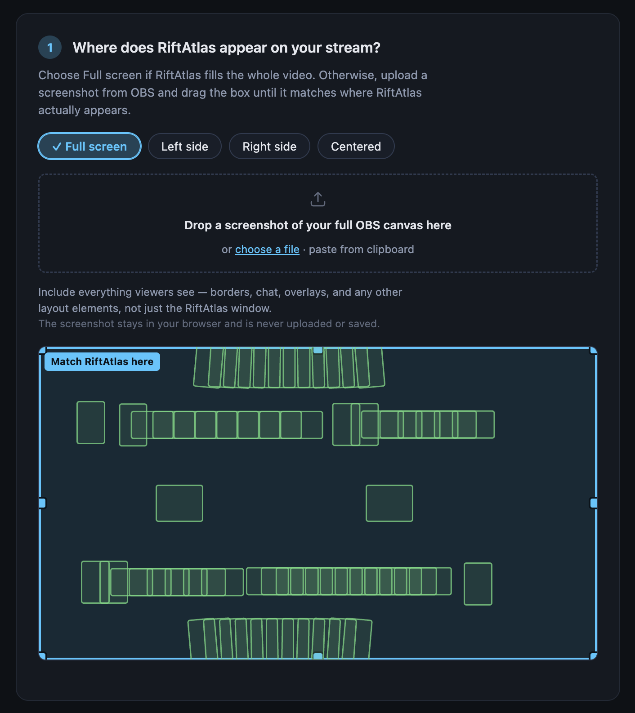
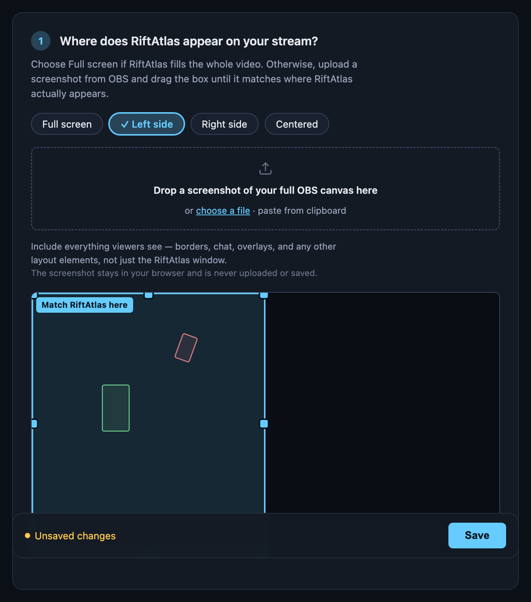
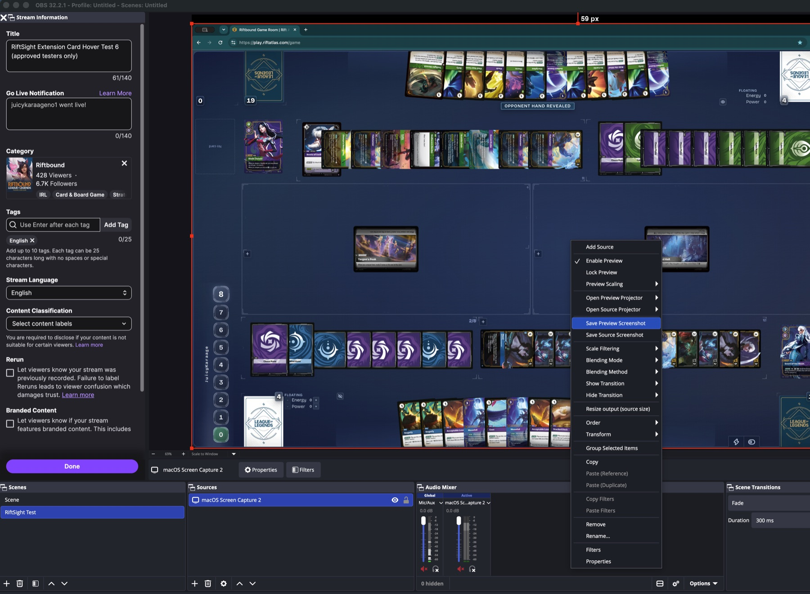
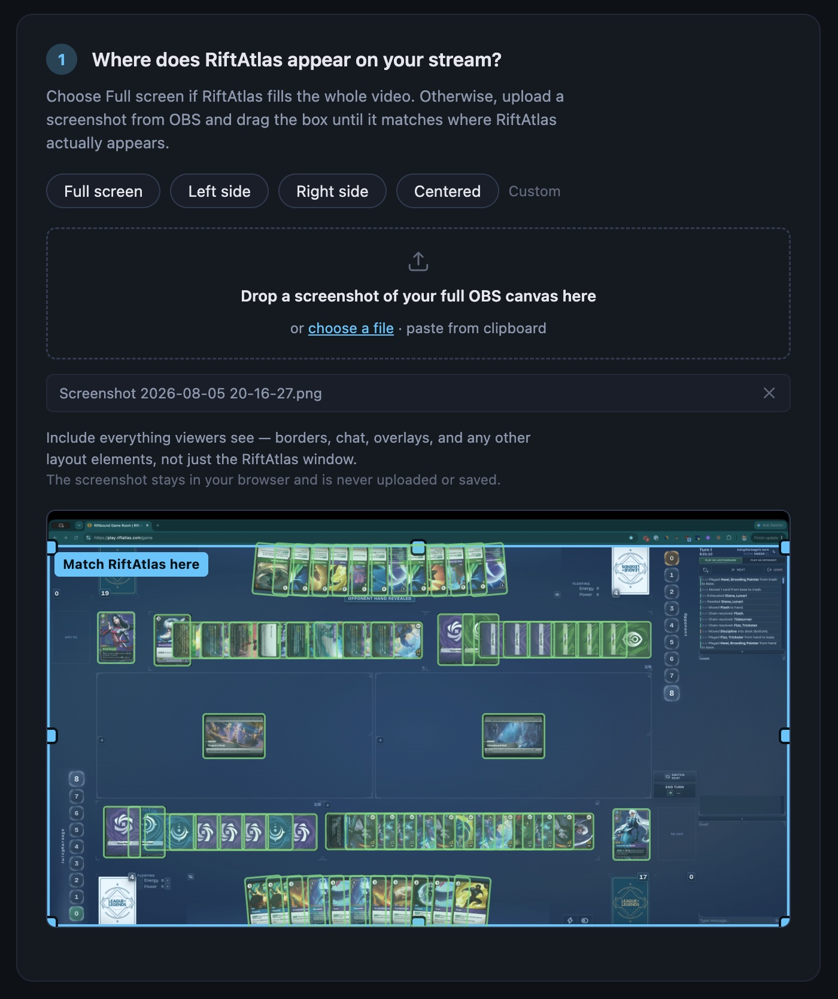
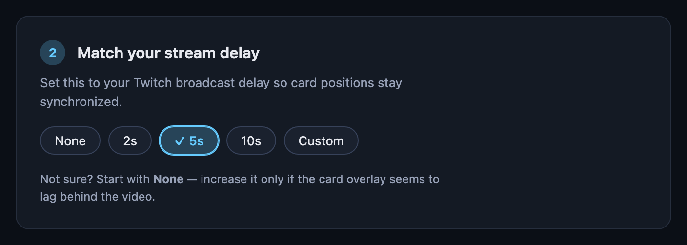
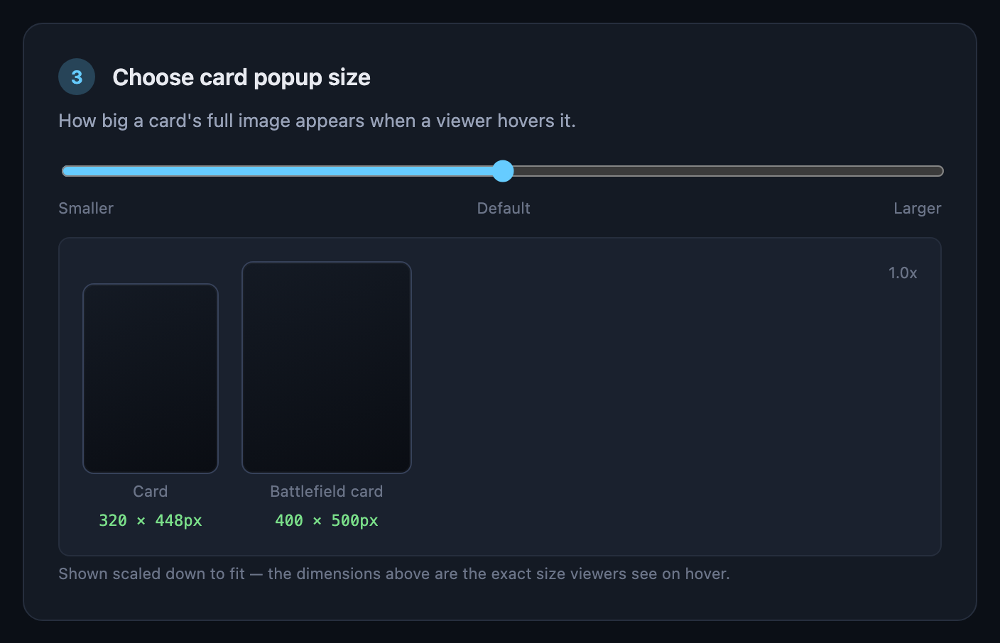
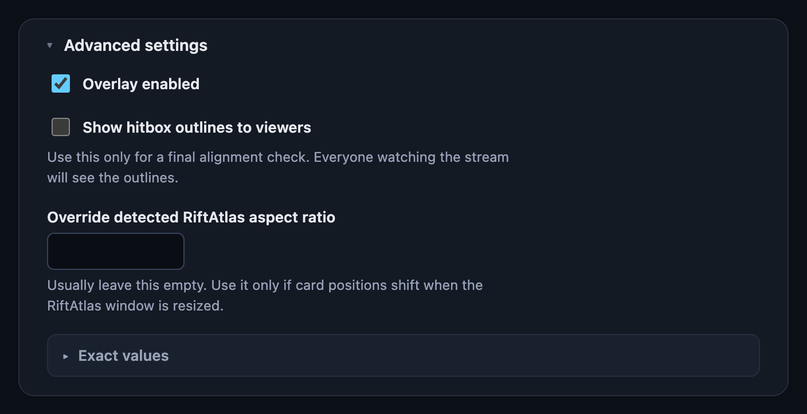

# RiftSight — Streamer Setup Guide

Welcome to the RiftSight beta! This guide is everything you need to get set up. No coding, terminal, or technical knowledge required.

RiftSight lets your viewers hover over cards visible on your stream to see the full card art, live. You just need to install one browser extension and turn on one Twitch extension. RiftSight handles the rest automatically.

## Before you start

Someone on the RiftSight team needs to have already added your Twitch account to the beta. If you haven't heard back that you're in, check with whoever invited you before continuing.

You'll also need **Chrome (or another Chromium-based browser, like Edge or Brave)** to install the extension in Step 1 — this only applies to you as the streamer. Your viewers can watch and hover over cards in any browser; see [the viewer guide](viewer-guide.md).

## Step 1 — Install the RiftSight browser extension

1. Download and unzip the `riftsight-extension.zip` file you were given.
2. Open a new Chrome tab and go to `chrome://extensions`.
3. Turn on **Developer mode** — there's a toggle in the top-right corner of that page.
4. Click **Load unpacked**.
5. Select the folder you unzipped in step 1.

You should now see a purple RiftSight icon appear in your Chrome toolbar (top-right, near the address bar). If you don't see it, click the puzzle-piece icon in the toolbar and pin RiftSight so it's always visible.

## Step 2 — Connect your Twitch account

1. Click the RiftSight icon in your toolbar. A small panel opens.
2. Click **Connect Twitch**.
3. A new tab opens asking you to authorize RiftSight on Twitch. Click through it.
4. Once it says "Connected," you can close that tab and go back to the RiftSight panel.
5. The panel should now say **Connected as `<your Twitch username>`**.

If it instead says your account isn't part of the beta yet, you weren't added in time — reach out to whoever invited you.

## Step 3 — Open RiftAtlas and start publishing

1. Open RiftAtlas in a browser tab, like you normally would.
2. Click the RiftSight icon again. Under "RiftAtlas," it should say **RiftAtlas detected** once you're in an active game.
3. Click **Start publishing**. You should see a green indicator in the bottom-right corner of the RiftSight extension icon, confirming you're successfully publishing.

That's it — RiftSight is now watching your game and will send card info to your viewers automatically. You don't need to keep the panel open; it'll keep working in the background as long as RiftAtlas stays open.

## Step 4 — Turn on the RiftSight extension on your Twitch channel

This is a separate, one-time setup step on Twitch's own side:

1. Go to your Twitch Creator Dashboard → **Extensions** → **My Extensions**.
2. Find **RiftSight** and activate it.
3. Assign it to a **Video Overlay** slot.

## Step 5 — A couple of quick settings

Twitch gives every extension its own settings page. From the same Extensions area as step 4, look for a **Configure** link or gear icon next to RiftSight and open it. It's a short, 3-step setup:

### Where does RiftAtlas appear on your stream?

If RiftAtlas fills your whole stream (no webcam, no other panels around it), just pick **Full screen** and skip ahead to matching your stream delay below:

Otherwise, pick whichever preset is closest (**Left side** / **Right side** / **Centered**), or drag and resize the box yourself until it matches where RiftAtlas actually shows up. To make that easier, drop in a screenshot of your real stream output — the box then overlays on top of your actual layout so you can line it up by eye instead of guessing blind:

*Tip: in OBS, right-click inside the Preview canvas and choose **Save Preview Screenshot** (not "Save Source Screenshot" — that one only grabs the RiftAtlas capture by itself and skips any webcam, chat box, or overlays you have layered around it). This saves a PNG of your full composited canvas, exactly like a normal OS screenshot tool would, but guaranteed to match your actual stream output pixel-for-pixel.*

Nothing you drop in gets uploaded or saved anywhere — it's only there to help you align, and it disappears the next time you reload the page.

Here's what it looks like once a screenshot is dropped in and the box is matched up — every green outline lines up with an actual card, hand to base to runes:

Those green outlines are part of the calibration preview itself, so you'll always see them here while lining things up — they're separate from **Show hitbox outlines to viewers** in Advanced settings below, which controls whether your actual viewers see them on the live stream.

*Heads up: Twitch's own player controls (play/pause, volume, etc.) sit on top of every video overlay extension along the very bottom edge of the video — a Twitch platform rule, not something RiftSight can change. If your layout puts cards right at the bottom edge, viewers in a small or windowed player may find those specific cards harder to hover (fullscreen doesn't have this issue). Not something to worry about unless a viewer actually reports it — just worth knowing if one does.*

### Match your stream delay

Pick **None** / **2s** / **5s** / **10s**, or enter a custom value, to match whatever delay you use in OBS/your broadcast software. Not sure? Start with **None** — you can always come back and increase it later if the card overlay seems to lag behind the video.

### Choose card popup size

Pick **Smaller** / **Default** / **Larger** for how big the card art appears when a viewer hovers, with a live preview of the exact pixel size for both card types.

### Advanced settings

Collapsed by default — most streamers never need to open this. It has things like a **Show hitbox outlines** option, which shows a visible box around every hoverable card and is handy if you want to double-check your calibration looks right before going live.

## Step 6 — Go live and check it's working

Start your stream as normal. Then, from a **separate device or account** (not your own streamer account), open your channel and hover over a visible card. You should see its full art pop up.

## Understanding the RiftSight icon

The RiftSight icon in your toolbar has a small colored dot that tells you the status at a glance, even without opening the panel:

| Color | Meaning |
|---|---|
| ⚪ Gray | Not connected to Twitch yet |
| 🟡 Yellow | Connected, but not currently publishing |
| 🟢 Green | Actively publishing — everything's working |
| 🔴 Red | Connected, but having trouble reaching RiftSight right now (it'll keep retrying automatically) |

## Common questions

**Do I need to click "Start publishing" every time I stream?**
No. Once you've clicked it, RiftSight remembers — it survives closing RiftAtlas, reloading the page, restarting your browser, everything. It automatically pauses when you're not in an active game and resumes when you are. You only need to click **Stop publishing** if you actually want it off.

**Do my viewers need to install anything?**
No. Only you (the streamer) install the browser extension. Viewers just need the RiftSight extension active on your channel — Twitch handles the rest for them automatically.

**Something looks wrong / a card isn't showing correctly.**
Reach out to whoever invited you to the beta with as much detail as you can — what card, what you expected vs. what you saw, and roughly when it happened. See the [viewer guide](viewer-guide.md) if you want to know what your viewers should be checking too.

**Do I need to keep any terminal window or program running?**
No — just your browser, with RiftAtlas open and the RiftSight extension installed.

**What browsers does this work on?**
For you as the streamer: Chrome or another Chromium-based browser (Edge, Brave), since the extension you install in Step 1 only comes in that format. For your viewers: any browser Twitch itself supports — they're just watching a normal Twitch extension, no install required.

## Streaming on YouTube

RiftSight also works for YouTube live streams — the difference is where the
overlay lives. On Twitch, Twitch itself shows the overlay to every viewer
with nothing to install. YouTube has no equivalent extension platform, so
each YouTube viewer needs the RiftSight browser extension installed (the
same one you use), with YouTube enabled in it. Your side stays almost
identical: keep publishing from Rift Atlas exactly as today, plus a
one-time setup.

### One-time YouTube setup (streamer)

1. **Link your channel.** Open the RiftSight popup → ⚙ Settings →
   *YouTube channel (beta)* → paste your channel ID (starts with `UC…`)
   or a `youtube.com/channel/UC…` URL, then **Save channel**. Find your
   ID in YouTube Studio under *Settings → Channel → Advanced settings*.
   Handles (`@name`) don't work here — it has to be the `UC…` id. This
   link is what lets viewers' extensions find your game session from your
   watch page. One channel per RiftSight account; saving a new one
   replaces the old. (Verified "Connect YouTube" sign-in replaces this
   manual step once enabled — and YouTube-only streamers won't need a
   Twitch account at all.)
2. **Calibrate the overlay.** Popup → **Calibrate overlay…** opens a
   calibration page: drag the rectangle to where Rift Atlas sits in your
   stream layout (same idea as the Twitch config page — while you're
   publishing, your real card hitboxes preview live inside the
   rectangle). Set a **recommended stream delay** matching your usual
   YouTube latency (Normal latency is typically 8–15s, Low 4–8s) — it
   seeds each viewer's delay control, and they can fine-tune from the
   overlay's gear button. Click **Save calibration**; it publishes with
   your next board update.

Note the calibration page configures YouTube (and any future non-Twitch)
viewers only — your Twitch Extension settings live where they always have.

### What your YouTube viewers do

They install the RiftSight extension, click **Enable RiftSight on
YouTube** in its popup once, and open your live stream. The overlay
appears automatically on live watch pages of your claimed channel and
shows nothing anywhere else. VODs aren't supported yet — live streams
only.
